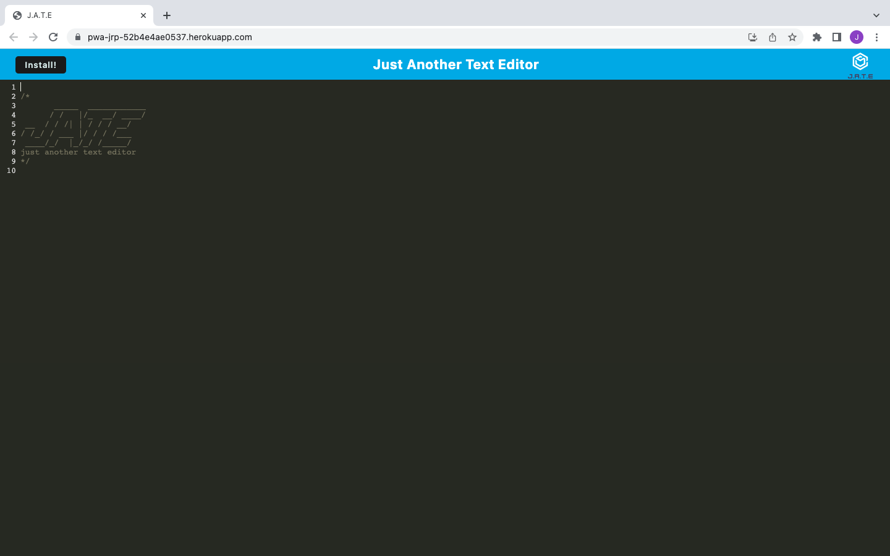

# Just Another Text Editor

## Description

My motivation for this project was to build a text editor that runs in the browser and meets the PWA (Progressive Web Application) criteria.

## Table of Contents

- [Installation](#installation)
- [Usage](#usage)
- [Links](#links)
- [License](#license)
- [Questions](#questions)

## Installation

To install Just Another Text Editor (JATE), follow the below steps:

1. To set up your environment, please begin by making sure you already have the following installed:
- An open source code editor, such as VS Code
- Git Bash or Zsh (to use in Git command line)
- Node.js
2. Download the .zip file or clone the repository into your source-code editor.
3. Navigate to the root directory of the repository in your terminal and run "npm i" to install the required dependencies.

## Usage

To use JATE, follow the below steps:

1. Start the application by running "npm start" in the terminal. It should open in your web browser.
2. Once the application is running in your web browser, you have the option to install it on your computer for offline use.
3. If you close and reopen JATE, any text you entered will be retrieved from IndexedDB.

JATE Screenshot: 

## Links

GitHub Repository: https://github.com/jparker1221/text-editor-module-19-pwa

Heroku Deployed Application: https://pwa-jrp-52b4e4ae0537.herokuapp.com/

## License

This application is covered under the MIT License. For more information about this license, visit https://opensource.org/license/mit/.

## Questions

### If you have any questions regarding this project, you can reach me here:

- GitHub: https://github.com/jparker1221
- Email: jonparker1221@gmail.com
